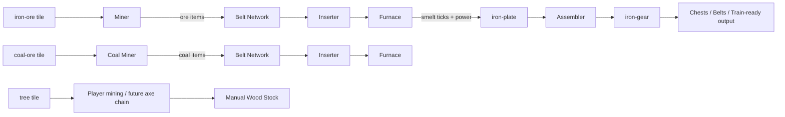
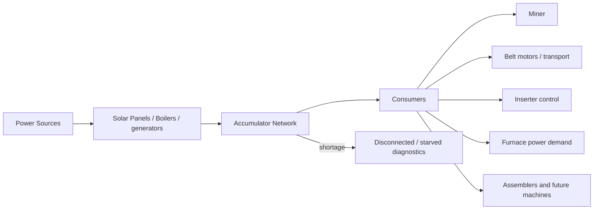
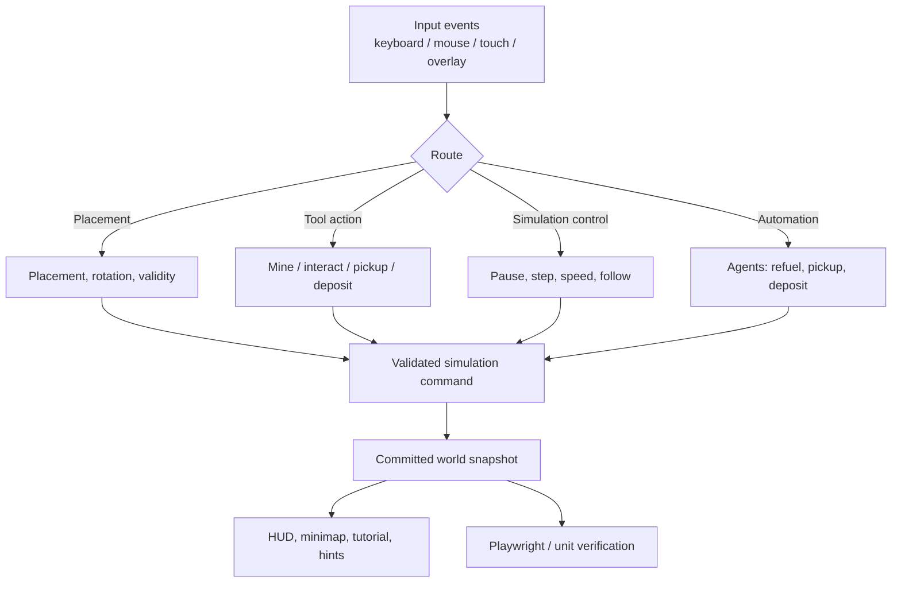
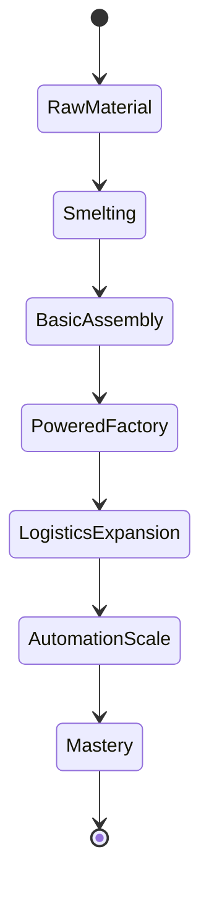

# Agents Ultra End-Goal Spec: Factorio-Style Growth Blueprint

## 1) Purpose

Agents Ultra is no longer just a vertical slice; it is a persistent, deterministic automation game with a clear production and automation arc.  
This document is the "end-goal" contract used before each Agent Swarm launch.

Primary objective: move from “core extraction to plates” toward a stable factory loop that supports:

- scalable resource extraction,
- deterministic manufacturing chains,
- meaningful logistics and power planning,
- automation tooling,
- guided player progression,
- robust testability and operations.

This is deliberately ambitious but sequenced so each stage can be shipped and validated independently.

## 2) Flow charts that define the architecture

### 2.1 Primary throughput loop

### 2.2 Power flow architecture

### 2.3 Player and automation control flow

### 2.4 Content progression state (goal)

## 3) Factorio feature gap model

This is what “Factorio-like” means for Agents Ultra in practice.

### World and resources

- Implemented: finite ore (iron, coal), tree extraction, deterministic map generation.
- Missing / next: richer biome generation, oil/fluid nodes, finite depletion strategy, environmental progression and map editing tools.
- Target: retain determinism while adding controlled complexity via resource modifiers and density tuning.

### Production

- Implemented: miner, belt, splitter, inserter, furnace, chest, assembler, recipe chaining.
- Missing / next: multi-input recipes, recipe unlock progression, throughput balancing, production bottleneck analysis UI, and recipe filtering.
- Target: recipe system with discoverable unlocks and meaningful choices.

### Logistics

- Implemented: direct belt/splitter paths and basic chest movement.
- Missing / next: underground transport, filtered routing, lane priority controls, smart routing hints, and future robot logistics.
- Target: explicit routing tools that improve reliability without hand-holding.

### Energy

- Implemented: global power accounting, supply/demand diagnostics, accumulator behavior.
- Missing / next: power network graph with poles, transformer/transfer losses, alternative fuels, and network troubleshooting panel.
- Target: meaningful power planning before base scale-up, with visible shortfalls.

### Automation

- Implemented: runtime pause/step, history, templates, and automation toggles.
- Missing / next: mission-driven auto-build pipelines, replay-safe command plans, and failure-mode recovery for plans.
- Target: robust macro play with observable outcomes and rollback.

### Player systems

- Implemented: movement, interaction, collisions, fuel/refuel, hand interactions, HUD/probes.
- Missing / next: better fatigue/encumbrance, craftable tool progression, richer interaction surfaces, and accessibility-first navigation.
- Target: strong interaction clarity at all zoom levels and input modes.

### Testing and operations

- Implemented: deterministic unit/integration tests, movement gate, Playwright smoke.
- Missing / next: deterministic throughput benchmarks, scenario harness, perf budgets and baseline snapshots per milestone.
- Target: every high-impact feature has a gate and a migration-safe acceptance test.

## 4) “How we get there” plan

### Phase 0: Foundation hardening (already in progress)

- Keep simulation contracts strict, especially command validation and snapshot boundaries.
- Stabilize all non-visual rendering paths before adding complexity.
- Expand diagnostics for blocked miners, idle inserters, and power starvation.

### Phase 1: Production maturity

- Add throughput dashboards for all production chains.
- Add recipe unlock and recipe-category system.
- Add deterministic pipeline balancing for splitters and long belt lines.

### Phase 2: Logistics maturity

- Add underground belts and crossing constraints.
- Add filtered routing/lane control.
- Add belt and inserter throughput telemetry overlays.

### Phase 3: Power maturity

- Implement explicit power graph display and transfer capacity limits.
- Introduce alternative fuels and fuel economy tradeoffs.
- Add optional base-wide optimization challenge objectives.

### Phase 4: Automation and player growth

- Add goal-oriented missions tied to real mechanics.
- Add mission gating for new machine unlocks.
- Add scenario save artifacts and benchmarked difficulty tiers.

### Phase 5: Long-run scalability

- Add robots/train-like logistics shell.
- Add multiplayer-safe checkpoints and shareable blueprints.
- Add moderation-safe multiplayer collaboration workflow.

## 5) What “done” looks like for each phase

For any phase item to close, all conditions must pass:

- deterministic behavior: same commands, same outcomes, same tick ordering,
- observable UI: the HUD/minimap/probe signals that state changed,
- resilience: save/load and undo/replay preserve causality,
- coverage: targeted unit suite plus at least one Playwright checkpoint.

## 6) SPARK launch checklist (agent-swarm preflight)

Use this before every Agent Swarm pass. SPARK means:

- **S**cope: every agent has an exact deliverable with acceptance criteria,
- **P**lan: each task maps to an entry in this spec and an owning phase,
- **A**genda: sequence and dependency graph is known before coding,
- **R**eliability: each change has tests and a roll-forward/rollback step,
- **K**ickoff evidence: first task has a reproducible validation command and no unresolved blocker.

Agents are considered “sparked” only when all five SPARK checks are true.

## 7) Immediate “first launch” tasks

- finalize this matrix into an issue-level backlog with owner IDs,
- convert three largest production bottlenecks into explicit acceptance stories,
- add a production throughput dashboard card,
- add a power graph diagnostics card,
- add scenario-based E2E smoke with a fixed baseline factory build.

## 8) Documentation and process standards

- Every new gameplay loop ships with:
  - one specification update in this file,
  - one simulation test cluster,
  - one UI regression case when visible behavior changes,
  - one performance note in changelog docs.
- Before another agent-swarm launch, this spec must be updated with any changed scope or dependencies.

